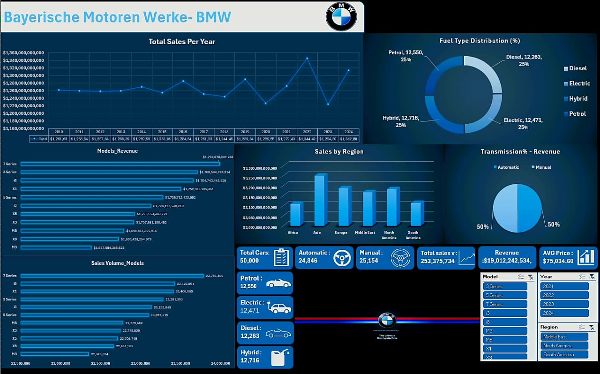

# 🚗 BMW Sales Analytics & Classification Project

An end-to-end BMW sales analytics and machine learning project using Excel, Power Query, Power Pivot, Python, and Scikit-learn.

The project combines:
- Business Intelligence
- Data Analysis
- Interactive Dashboarding
- Machine Learning Classification

---

# 📌 Project Overview

This project analyzes BMW global sales data from 2010 to 2024 and predicts whether sales are classified as High Sales or Low Sales using KNN Classification.

The solution includes:
- Interactive Excel Dashboard
- Data Cleaning & Transformation
- Machine Learning Pipeline
- Business KPI Analysis

---

# 🛠️ Technologies Used

- Excel
- Power Query
- Power Pivot
- Python
- Pandas
- NumPy
- Scikit-learn
- Matplotlib
- Joblib

---

# 📊 Dashboard Features

- Total Revenue Analysis
- Sales by Region
- Fuel Type Distribution
- Transmission Revenue Analysis
- Sales Volume by Model
- Interactive Filters & Slicers
- KPI Monitoring

---

# 🤖 Machine Learning

## Model Used
- KNN Classification

## Objective
Predict:
- High Sales
- Low Sales

## ML Workflow
- Data Cleaning
- Feature Encoding
- Feature Scaling
- Model Training
- Model Serialization (.pkl)

---

# 📂 Project Structure

```bash
├── Dashboard/
├── Data/
├── Machine_Learning/
├── README.md
└── requirements.txt
```

---

# 📸 Dashboard Preview

## Main Dashboard



---

# 📈 Business Insights

- Asia generated the highest regional sales revenue.
- Automatic transmission vehicles contributed significantly to total revenue.
- Fuel type distribution remained balanced across categories.
- Certain BMW models consistently dominated sales volume.

---

# 🚀 Future Improvements

- Deploy ML model using Flask/FastAPI
- Real-time dashboard integration
- Advanced predictive analytics
- API-based data ingestion
- Cloud deployment

---

# 👨‍💻 Author

Kareem Abdelrhman

GitHub:
https://github.com/Kareem-opps
